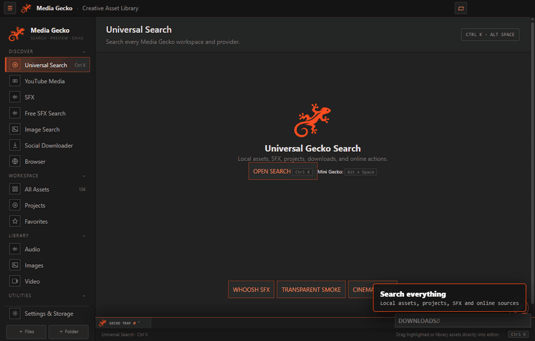
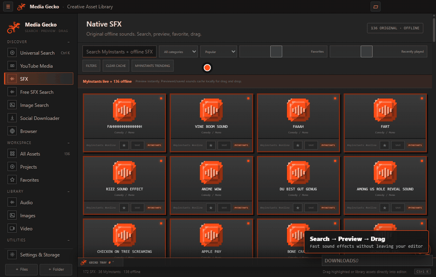
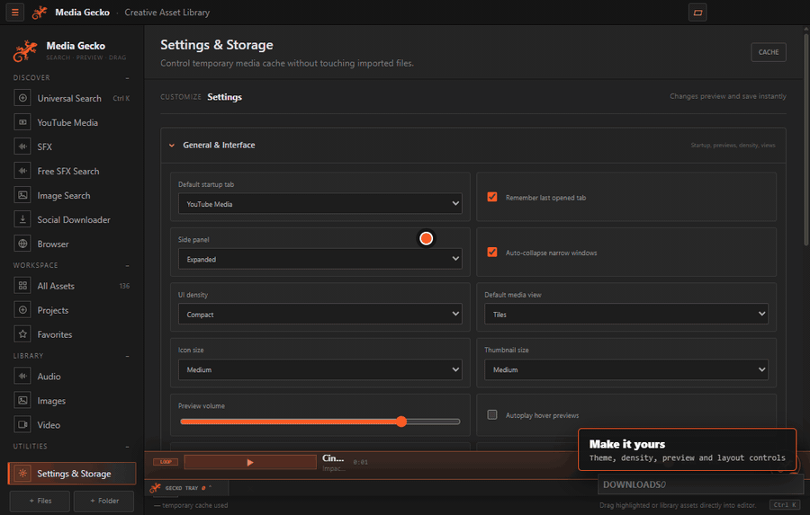

# Media Gecko

> A fast Windows creative asset hub for video editors. Search, preview, organize, download, and drag media directly into Premiere Pro, After Effects, or any folder.

## Download Media Gecko for Windows

**[⬇ Download the Windows installer directly (.EXE, approximately 162 MB)](https://github.com/ffoouuaadd/media-gecko/releases/download/v1.5.3/Media-Gecko-Setup-1.5.3.exe)**

No GitHub knowledge is needed: click the button, wait for the download, run the installer, and launch Media Gecko from the Start menu. Windows may show a SmartScreen notice because the installer is not yet signed with a trusted commercial certificate.

Media Gecko keeps the creative workflow inside one compact desktop app: local libraries, online SFX, Google Images, media downloads, an internal browser, and a project-aware assistant. The core loop is deliberately simple: **Search → Preview → Drag → Drop.**

## Highlights

- **Instant sound workflow:** preview 136 bundled offline effects, search MyInstants and free providers, then drag cached audio like a normal Windows file.
- **Visual asset workspace:** search Google Images inside a dedicated window, preview images and transparent PNGs, and save them into the local library.
- **Editor-first library:** index existing folders without duplicating files; categorize, tag, favorite, filter, preview, and organize assets.
- **Built-in browser and downloads:** browse asset sites without switching apps, with supported downloads automatically added to the library.
- **Compact creative tools:** Mini Gecko, universal search, Gecko Tray, projects, SFX Lab, customizable layouts, and polished dark/light themes.
- **Gecko Assistant:** discuss an edit and launch targeted image, SFX, video, or local-library searches from the conversation.

## See it in action

### Search, preview, and drag sound effects

### Themes and compact layouts

## Start

1. Run `setup.ps1` once to install local yt-dlp and FFmpeg tools.
2. Run `install-app.ps1` once to install Electron dependencies.
3. Run `start-app.cmd` during development, or install the app using the Setup EXE from `dist`.

## Workflow

- Search YouTube with background preview prewarming and session caching. Download default MP3 or optional MP4, then drag.
- Search Commons, Mixkit, Internet Archive, and Openverse from one progressive SFX view. Hover never downloads. Preview streams only; drag preparation and downloads require explicit actions.
- Filter SFX by duration, category, source, format, channel metadata, quality, favorites, downloaded state, and recent use. Sort by relevance, popularity, newest, shortest, or longest.
- Analyze supported public Instagram Reels, TikTok posts, and YouTube URLs before downloading full-quality MP4 video or MP3 audio.
- Open Google Images directly inside a dedicated image workspace. Search uses full Google Images site instead of custom result cards. Right-click or drag supported images into Media Gecko.
- Preview YouTube video in a cached 480p player without leaving Media Gecko.
- Browse asset sites in up to six internal tabs. Supported downloads enter the library automatically. Browser images support local drag preparation and image context actions.
- Import local media files or folders. Media Gecko indexes original paths without copying files.
- Preview audio with one global player, seek bar, time, duration, and volume.
- Preview transparent images on a checkerboard and drag cards into editors or folders.
- Switch between icon, tile, and compact content views. Preferred view persists.
- Reorder navigation and library categories with drag and drop, move navigation items between groups, hide unused items, and collapse category labels to icons.
- Collapse the side panel to icons, hide it completely, or let it auto-collapse when the window becomes narrow. Layout and window preferences persist.
- Customize startup behavior, preview controls, density, icon and thumbnail sizes, cache folders, Windows startup, hardware acceleration, and performance mode from Settings.
- Choose from six neutral themes: Ember, Electric Blue, Violet, Pure Black, Warm Light, and Cool Light. One custom accent control remains.
- Use Native SFX for 136 original offline sound buttons with search, 15 categories, favorites, recent playback, preview, file actions, and native file drag.
- Open Universal Search with `Ctrl+K`, or Mini Gecko with `Alt+Space`, to search local assets, projects, and provider actions.
- Use compact Gecko Assistant to discuss current project and create one-click image, SFX, video, or local-library searches. OpenAI API key stays encrypted through Windows secure storage. API usage requires separate OpenAI API billing.
- Keep reusable assets in persistent Gecko Tray and drag them into Windows editors at any time.
- Organize large libraries with SQLite indexing, paging, smart folders, watched folders, rules, exact duplicate review, and similar-asset search.
- Build projects with notes and linked assets without moving or duplicating original media.
- Process audio non-destructively in SFX Lab with speed, pitch, EQ, reverb, reverse, normalization, mono, and trim controls.
- Track media downloads in one progress queue with speed, ETA, completion, failure, and cancellation states.
- Switch between designed dark and light appearances. Gecko branding and the running window icon follow the selected accent color.
- Edit display name, virtual category, tags, and favorite state.
- Manage preview, download, image, and audio caches separately. Cache limits remove oldest temporary files without deleting imported local media.

## Automatic SFX categories

Whooshes, Impacts, Hits, Risers, Downers, Glitches, UI / Interface, Transitions, Ambience, Nature, Vehicles, Weapons, Footsteps, Crowd, Technology, Gaming, Comedy / Meme, Cinematic, and Other.

Classification uses filename keywords and file metadata. Imported audio duration is read with FFprobe. Original media stays untouched.

## Supported local formats

- Audio: MP3, WAV, OGG, M4A, AAC, FLAC, OPUS
- Images: PNG, JPG, JPEG, WEBP, GIF, BMP, AVIF
- Video index: MP4, MOV, MKV, WEBM, AVI

## Storage

- Indexed references: Media Gecko user-data folder
- Online cache: Media Gecko user-data cache
- Explicit media downloads: `Downloads\Media Gecko`

Provider licenses still apply. Check each item before publishing.

## Windows installer

Run `dist\Media-Gecko-Setup-1.5.3.exe` once. Version 1.5 adds a dedicated Google Images workspace, floating Mini Gecko photo previews, full accent palette customization, theme-aware controls, and a branded animated installer finish. Another Windows x64 PC can use the same installer without Node.js or separate media tools. Windows may show a SmartScreen warning because the app does not yet have trusted code signing.

MyInstants is integrated as a live native-card search. Previewed, saved, or dragged results cache locally as normal MP3 assets; the full remote catalogue is not bundled. Each upload's rights still apply.

The portable build remains available through `pnpm run build:portable` when needed.
